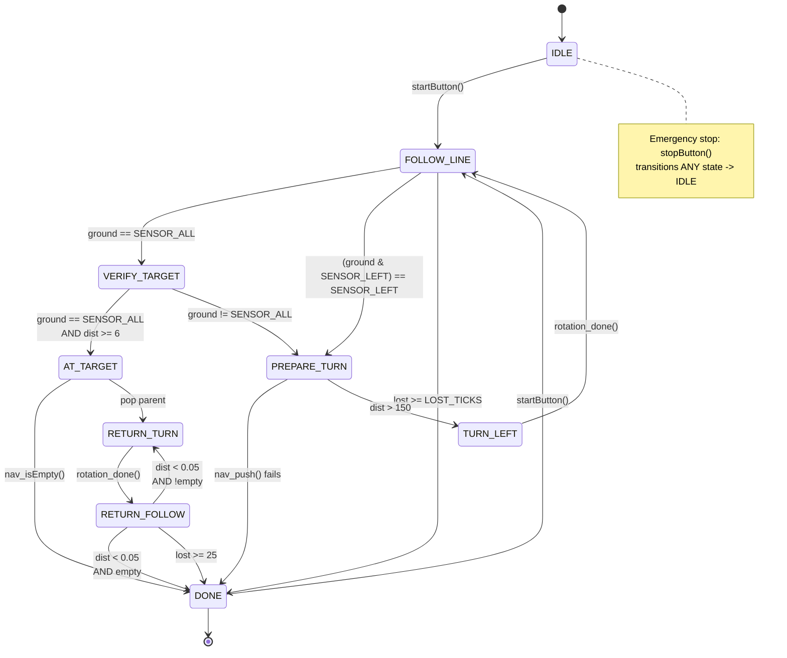

# TP2 Path Finder Robot

Embedded C agent for a differential-drive PIC32 robot (DETI MR32 platform).  
Follows black lines, turns left at intersections, detects a wide target line, and returns to the start position via parent-pointer DFS.

## Mission Overview

- Phase 1 — **Explore**: Follow lines and always turn left at intersections (acyclic tree exploration)
- Phase 2 — **Detect Target**: Distinguish the wide target line from normal intersections using a distance threshold
- Phase 3 — **Return**: Navigate back to the start via the shortest path using a static pose stack recorded during exploration

## Quick Start

1. Enter the Nix development shell: `nix develop --impure`
2. Ensure `pic32-64-2017_09_15.tgz` exists in the project root (`.gitignore`d, not tracked)
3. Build: `make` (default `ROBOT=1`) or `make ROBOT=5` for specific calibration
4. Flash: `make flash` (robot USB must be connected)
5. Run: `make run` (build + flash + serial terminal)
6. Press the robot's **start button** to begin the mission

> **Note**: `src/pcompile` contains a hardcoded Nix store path. If the flake is rebuilt on a new machine, this path may become stale. Always use `make` (which uses the local `src/pcompile`) rather than calling `pcompile` directly.

## Repository Structure

```
.
├── Makefile              # Build system (supports ROBOT=N calibration)
├── src/
│   ├── robot-agent.c     # Main loop: init, 40 ms tick, sensor dispatch
│   ├── state_machine.c/h # 9-state table-driven FSM
│   ├── line_follower.c/h # Bang-bang line following
│   ├── rotation.c/h      # PI heading controller for in-place turns
│   ├── nav_stack.c/h     # Static pose stack (parent-pointer DFS)
│   ├── leds.c/h          # Phase indication via 4 on-board LEDs
│   ├── logging.c/h       # printf-based state transition logging
│   ├── config.h          # Compile-time constants, sensor masks, Pose typedef
│   └── rm-mr32.c/h       # DETI hardware library (READ-ONLY)
├── docs/
│   ├── specs/
│   │   └── functional-spec.md  # Full FR-XXX requirements
│   └── references.md     # Curated links on PID, odometry, PIC32
├── assignment.md         # Official course assignment
└── AGENTS.md             # Project coding guidelines & architecture notes
```

## Hardware Platform

- **Platform**: DETI MR32 differential-drive robot
- **MCU**: PIC32MX (MIPS M4K core, no hardware FPU)
- **Sensors**: 5-bit ground IR sensor array, wheel encoders
- **Actuators**: 2 DC motors with closed-loop PID velocity control
- **I/O**: Physical start/stop buttons, 4 status LEDs
- **Control frequency**: 25 Hz (40 ms periodic tick)

## Build & Deploy

| Command | Description |
|---------|-------------|
| `make` | Build with default `ROBOT=1` |
| `make ROBOT=5` | Build with robot 5 servo calibration |
| `make flash` | Build and flash to robot via USB |
| `make run` | Build + flash + open serial terminal |
| `make term` | Open serial terminal only |
| `make clean` | Remove all build artifacts |

Supported robot IDs: 1, 2, 3, 5, 6, 7, 8, 9, 10, 11, 12.

Build artifacts are placed in `build/`:
- `build/robot-agent.hex` — Flashable binary
- `build/robot-agent.elf` — Linked ELF
- `build/*.o` — Object files
- `build/robot-agent.map` — Linker map

## State Machine

**State Descriptions**:

| State | Phase | Description |
|-------|-------|-------------|
| `STATE_IDLE` | — | Motors off, waiting for `startButton()` |
| `STATE_FOLLOW_LINE` | 1 | Bang-bang line following; detects intersections and left-path shortcuts |
| `STATE_VERIFY_TARGET` | 2 | Validates whether wide pattern is target (persistent + distance) |
| `STATE_PREPARE_TURN` | 1 | Push pose onto stack, drive forward into intersection |
| `STATE_TURN_LEFT` | 1 | Non-blocking 90° left turn (+π/2 rad) |
| `STATE_AT_TARGET` | 2 | Target confirmed; record pose; initiate return |
| `STATE_RETURN_TURN` | 3 | Turn toward parent node on the stack |
| `STATE_RETURN_FOLLOW` | 3 | Follow line to parent pose until within tolerance |
| `STATE_DONE` | — | Mission complete; motors off; wait for restart |

**State Transitions**:

| # | From | To | Condition |
|---|------|----|-----------|
| 1 | `IDLE` | `FOLLOW_LINE` | `startButton()` pressed |
| 2 | `FOLLOW_LINE` | `VERIFY_TARGET` | `ground == SENSOR_ALL` (intersection or target candidate) |
| 3 | `FOLLOW_LINE` | `PREPARE_TURN` | `(ground & SENSOR_LEFT) == SENSOR_LEFT` (path to left, skip verification) |
| 4 | `FOLLOW_LINE` | `DONE` | Lost line for ≥ `LOST_TICKS` (25 ticks ≈ 1 s) |
| 5 | `VERIFY_TARGET` | `AT_TARGET` | `ground == SENSOR_ALL` persists AND `dist >= TARGET_DIST_THRESHOLD` (6) |
| 6 | `VERIFY_TARGET` | `PREPARE_TURN` | `ground != SENSOR_ALL` before threshold (normal intersection) |
| 7 | `PREPARE_TURN` | `DONE` | `nav_push()` fails (stack overflow) |
| 8 | `PREPARE_TURN` | `TURN_LEFT` | `distIntoIntersection > INTERSECTION_CENTER_DIST` (150) |
| 9 | `TURN_LEFT` | `FOLLOW_LINE` | `rotation_done()` (90° left turn complete) |
| 10 | `AT_TARGET` | `DONE` | `nav_isEmpty()` (target was at start) |
| 11 | `AT_TARGET` | `RETURN_TURN` | Pop parent pose from stack, turn toward it |
| 12 | `RETURN_TURN` | `RETURN_FOLLOW` | `rotation_done()` (facing parent node) |
| 13 | `RETURN_FOLLOW` | `RETURN_TURN` | `dist < ORIGIN_TOLERANCE` (0.05 m) AND stack not empty (next parent) |
| 14 | `RETURN_FOLLOW` | `DONE` | `dist < ORIGIN_TOLERANCE` AND `nav_isEmpty()` (back at start, success) |
| 15 | `RETURN_FOLLOW` | `DONE` | Lost line for ≥ `LOST_TICKS` (reason: `LOST_RETURN`) |
| 16 | `DONE` | `FOLLOW_LINE` | `startButton()` pressed (restart mission) |
| 17 | *Any* | `IDLE` | `stopButton()` pressed (emergency stop) |

**Mermaid State Diagram**:



**ASCII Fallback Diagram**:

```
                              +------------------+
                              |   STATE_IDLE     |
                              | (wait for start) |
                              +--------+---------+
                                       | startButton()
                                       v
+-------------------+        +------------------+
|  STATE_TURN_LEFT  |<-------| STATE_FOLLOW_LINE|<-----------+
| (rotate +90 deg)  |        | (bang-bang follow)|            |
+--------+----------+        +--------+---------+            |
         | rotation_done()            |                      |
         v                            | SENSOR_ALL            |
+-------------------+                 v                      |
|  STATE_FOLLOW_LINE|        +------------------+             |
|  (resume follow)  |        |STATE_VERIFY_TARGET|            |
+-------------------+        +--------+---------+             |
                                      | pattern breaks        |
                    target confirmed  v                     |
                    +------------------+        +------------------+
                    |  STATE_AT_TARGET |        | STATE_PREPARE_TURN|
                    | (record, return) |        | (push, drive 150) |
                    +--------+---------+        +--------+---------+
                             | nav_isEmpty()            | dist > 150
                             v                          v
                    +------------------+        +------------------+
                    |    STATE_DONE    |        |  STATE_TURN_LEFT |
                    | (mission complete)|       +--------+---------+
                    +--------+---------+                 |
                             ^                           |
                             |                           |
         +-------------------+-------------------+       |
         |                                       |       |
         v                                       v       |
+-------------------+                    +------------------+
| STATE_RETURN_TURN |<-------------------|STATE_RETURN_FOLLOW|
| (turn to parent)  |  reached parent    | (follow to parent)|
+--------+----------+  & stack not empty +--------+---------+
         | rotation_done()                          |
         v                                          |
+-------------------+                               |
|STATE_RETURN_FOLLOW|                               |
| (follow to parent)|                               |
+--------+----------+                               |
         | reached parent & empty                   |
         v                                          |
+-------------------+                               |
|    STATE_DONE     |<------------------------------+
| (mission complete)|
+-------------------+
```

## Control Loop Discipline

The main loop in `robot-agent.c` is the only place that calls `waitTick40ms()`.  
**Never** use `delay()`, `wait()`, or busy-waiting for timing inside the real-time loop.

```c
while (1) {
    waitTick40ms();          // Macro: blocks until tick40ms==1, then clears it
    readAnalogSensors();     // MUST call this BEFORE readLineSensors(0)
    unsigned int ground = readLineSensors(0);
    // ... state machine tick ...
}
```

- **Avoid** calling `printf` on every 40 ms tick — it is slow and can destabilize the control loop. Print only on state transitions (infrequent events).
- **No floating-point in ISRs**: PIC32 FPU is slow; keep `double` math in the main loop.
- **No dynamic allocation**: No `malloc`/`free`. All structures are static.

## Sensor Interpretation

The 5-bit ground IR sensor array returns patterns from `readLineSensors(0)` (bit 4 = leftmost, bit 0 = rightmost):

| Pattern | Binary | Meaning |
|---------|--------|---------|
| `SENSOR_NONE` | `0b00000` | Lost line (white floor) |
| `SENSOR_CENTER` | `0b00100` | Centered on line |
| `SENSOR_LEFT` | `0b11000` | Line on left side → drift right |
| `SENSOR_RIGHT` | `0b00011` | Line on right side → drift left |
| `SENSOR_ALL` | `0b11111` | Wide black area (intersection or target) |

**Target vs. Intersection**: The target is confirmed only if `SENSOR_ALL` persists while the robot travels at least `TARGET_DIST_THRESHOLD` (6 units). If the pattern breaks before that distance, it was a normal intersection.

## LED Indicators

The 4 on-board LEDs indicate the current mission phase:

| LED | State(s) | Meaning |
|-----|----------|---------|
| LED 0 | `IDLE`, `FOLLOW_LINE`, `VERIFY_TARGET`, `PREPARE_TURN`, `TURN_LEFT` | Phase 1: Exploring |
| LED 1 | `AT_TARGET` | Phase 2: At target |
| LED 2 | `RETURN_TURN`, `RETURN_FOLLOW` | Phase 3: Returning |
| LED 3 (solid) | `DONE` + success | Mission complete |
| LED 3 (fast blink) | `DONE` + error | Mission failed (lost, stack overflow, etc.) |

## References

- [`docs/specs/functional-spec.md`](docs/specs/functional-spec.md) — Full functional requirements (FR-001 through FR-011)
- [`docs/references.md`](docs/references.md) — External resources on PID, odometry, and PIC32 programming
- [`assignment.md`](assignment.md) — Official course assignment description
- [`AGENTS.md`](AGENTS.md) — Project coding guidelines and architecture notes
